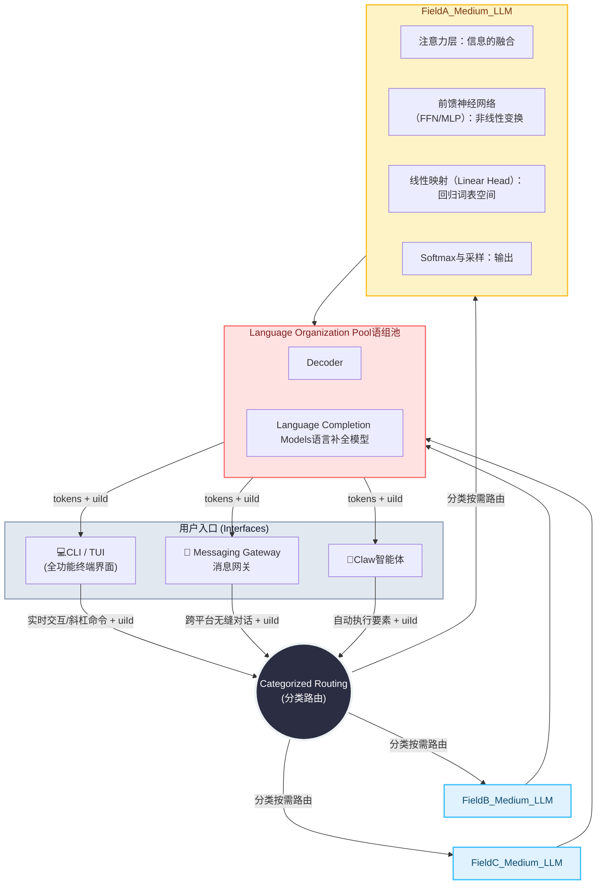

# limit_parameters_cermrist
A research of LLM ideas

This library is primarily designed to explore methods for implementing dynamic parameter linking in AI models.
Our approach favors limiting the total number of parameters within a single model. By employing techniques such as data-driven information mapping and localized updates, we aim to achieve dynamic parameter linking. The objective is to reduce the hardware requirements and overall scale of large language models, while simultaneously developing methods for the rapid loading of "experiential knowledge" to meet market demands and enable on-demand model adaptation.
We move away from the "search engine-style" paradigm of massive-parameter models. Instead—while maintaining a manageable hardware footprint and focusing on specific industries or domains—we concentrate on the practical application of AI within those specialized contexts, thereby avoiding the costs associated with abstract requirements and unnecessary, all-encompassing generality.
Supported by constraints on the number of "expert" modules, on-demand parameter scaling, structured knowledge representation, rapid reusability, and parallel computing, we are exploring the development of medium-scale models that are both concurrently executable and capable of private deployment.
We have observed that the current operational methods for large-scale models are highly inefficient; furthermore, probabilistic systems often lack sufficient focus and reliability when applied to complex or specialized tasks.
Although large language models are fundamentally dynamic information flows—constructed upon the Transformer architecture through complex matrix operations and attention mechanisms—most mainstream models currently rely predominantly on a decoder-only architecture.
While Mixture of Experts (MoE) models have addressed certain issues—specifically by constraining the computational scale to a manageable magnitude during active inference—they still suffer from inefficiencies related to full-model loading and resource wastage.
In response to these challenges, we have conceptualized several architectural ideas aimed at further decomposing and optimizing the processing of computational requirements.

这个库主要是用来研究模型参数动态连接的实现方式。
倾向于限制单个模型的参数总量，通过信息映射Data、局部刷新等方法实现参数动态连接，旨在降低大语言模型的硬件要求和规模, 并开发"经验"快速载入方式以满足市场需求，让模型按需调整。
摒弃搜索引擎式的巨量参数模型，在兼顾可控的硬件规模、有限的行业或领域，专注于某个行业或领域内的智能落地，避免为悬空的需求和无必要的无所不能及通用买单
通过约束模型的专家数量、按需控制参数规模、结构化经验、 快速复用、并行计算等支撑下探索可并发、私有化的中量模型。
我们注意到目前大模型的运行方式非常不经济，基于概率的系统在复杂或专业任务上缺乏足够的聚焦能力和可靠性
作为建立在 Transformer 架构之上的复杂矩阵运算和注意力机制构成的动态信息流，目前主流大模型主要采用的是仅解码器的架构
虽然混合专家模型解决了一些问题，在激活这个前提下，把计算规模限定在一定的数量级，但还是存在全量载入和资源浪费的情况
我们构思了一些架构想法，来进一步将需求分解



## For example
### 2026 年 某LLMs 用户热门提交问题 Top 10

| 排名     | 任务类型            | 典型提交问题示例                                |
| ------ | --------------- | --------------------------------------- |
| **1**  | **长文本总结与分析**    | “总结这个 50 页的行业报告，并用 5 个要点列出对业务的影响。”      |
| **2**  | **多模态图像生成**     | “基于我上传的照片，生成一个皮克斯风格的 3D 粘土人偶，背景要换成森林。”  |
| **3**  | **代码调试与优化**     | “检查这段 Python 代码的性能瓶颈，并重写一个更高效的版本。”      |
| **4**  | **工作邮件/文档草拟**   | “帮我写一封委婉但坚定的拒绝信，拒绝这个供应商的调价请求。”          |
| **5**  | **多语言翻译与润色**    | “将这段技术文档翻译成地道的英文，并确保符合学术论文的语气。”         |
| **6**  | **学习辅助/复杂概念解释** | “像教 10 岁小孩一样，给我解释一下什么是量子纠缠。”            |
| **7**  | **创意内容创作**      | “帮我写一个关于‘赛博朋克风格上海’的短视频脚本，包含分镜描述。”       |
| **8**  | **数据提取与表格化**    | “从这段杂乱的文本中提取所有公司名称和对应的利润，输出为 Excel 表格。” |
| **9**  | **生活规划与决策**     | “帮我规划一份为期 5 天的日本关西深度游路线，要求避开人流高峰。”      |
| **10** | **角色扮演与模拟面试**   | “请担任大厂资深架构师，对我进行一次关于高并发系统设计的模拟面试。”      |

```
帮我写一封委婉但坚定的拒绝信，拒绝这个供应商的调价请求。
输入转化
     帮我「写」一封「委婉」但「坚定」的「拒绝」「信」，「拒绝」这个「供应商」的「调价」请求。
提取
      写委婉坚定拒绝信(重复)[拒绝]供应商调价
抽取
      风格：委婉 坚定                                             ----- 向量化 ----   162 107 ...
      形式：拒绝信
      重点：拒绝
      目的：拒绝调价
      受众：供应商

基于我上传的照片，生成一个皮克斯风格的 3D 粘土人偶，背景要换成森林。
输入转化
     基于我「上传」的「照片」，[生成]一个「皮克斯风格」的 「3D」 「粘土人偶」，「背景」要换成「森林」。
提取
      上传照片(工具指引)[生成]皮克斯风格3D粘土人偶背景森林
抽取
      风格：皮克斯[风格]-特别指定                                  ----- 向量化 ----   218 134 ...
      形式：3D粘土人偶
      重点：上传 皮克斯风格 背景森林 
      目的：工具指引-生成-图像相关
      受众：未发现-暂代-用户自身
```
由此可见，用户提交的问题中或多或少存在形容类、修辞类、引导类、指代类等噪声，需要抽出目的、意图以及问题结构化，并明确任务重点，避免结果导向下，模型不能命中主要意图
反之生成的token也存在与之同样的情况, 在当前语言组织、润色、补全功能趋近完善的情况下，仍将这些功能由LLM来预测着实有些浪费模型资源，扩大了单个任务的计算量并增加非必要冗余

It is evident, therefore, that user-submitted queries invariably contain a certain degree of "noise"—such as descriptive phrasing, rhetorical flourishes, leading cues, or referential ambiguities. Consequently, it is essential to extract the underlying objective and intent, structure the query data, and clearly define the focal points of the task; this ensures that the model, even when operating under a results-oriented paradigm, does not fail to accurately identify and address the user's primary intent.

Conversely, the tokens generated by the model present a parallel situation. Given that current capabilities for linguistic organization, stylistic refinement, and content completion are already approaching a state of near-perfection, relying on a Large Language Model (LLM) to predict and execute these specific functions constitutes a genuine waste of computational resources—inflating the computational overhead for individual tasks and introducing unnecessary redundancy.

通过LLM领域化、语言组织能力移出LLM计算序列并Pool化、数据结构化等多种方法，降低单个模型的计算规模，以实现较低成本的大规模复用。

By employing various methods—such as domain-specific specialization of LLMs, externalizing and pooling language organization capabilities outside the LLM's computational sequence, and data structuring—we reduce the computational scale of individual models to enable cost-effective, large-scale reuse.

Trits from baoding
