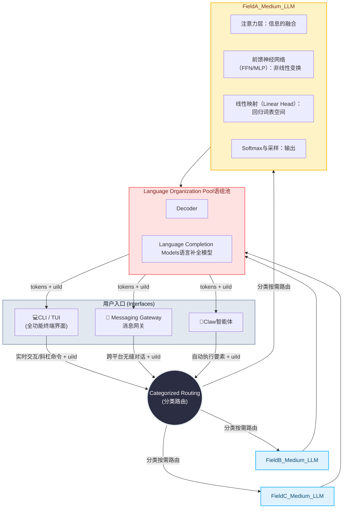

# limit_parameters_cermrist
A research of LLM ideas

This library is primarily designed to explore methods for implementing dynamic parameter linking in AI models.
Our approach favors limiting the total number of parameters within a single model. By employing techniques such as data-driven information mapping and localized updates, we aim to achieve dynamic parameter linking. The objective is to reduce the hardware requirements and overall scale of large language models, while simultaneously developing methods for the rapid loading of "experiential knowledge" to meet market demands and enable on-demand model adaptation.
We move away from the "search engine-style" paradigm of massive-parameter models. Instead—while maintaining a manageable hardware footprint and focusing on specific industries or domains—we concentrate on the practical application of AI within those specialized contexts, thereby avoiding the costs associated with abstract requirements and unnecessary, all-encompassing generality.
Supported by constraints on the number of "expert" modules, on-demand parameter scaling, structured knowledge representation, rapid reusability, and parallel computing, we are exploring the development of medium-scale models that are both concurrently executable and capable of private deployment.
We have observed that the current operational methods for large-scale models are highly inefficient; furthermore, probabilistic systems often lack sufficient focus and reliability when applied to complex or specialized tasks.
Although large language models are fundamentally dynamic information flows—constructed upon the Transformer architecture through complex matrix operations and attention mechanisms—most mainstream models currently rely predominantly on a decoder-only architecture.
While Mixture of Experts (MoE) models have addressed certain issues—specifically by constraining the computational scale to a manageable magnitude during active inference—they still suffer from inefficiencies related to full-model loading and resource wastage.
In response to these challenges, we have conceptualized several architectural ideas aimed at further decomposing and optimizing the processing of computational requirements.

这个库主要是用来研究模型参数动态连接的实现方式。
倾向于限制单个模型的参数总量，通过信息映射Data、局部刷新等方法实现参数动态连接，旨在降低大语言模型的硬件要求和规模, 并开发"经验"快速载入方式以满足市场需求，让模型按需调整。
摒弃搜索引擎式的巨量参数模型，在兼顾可控的硬件规模、有限的行业或领域，专注于某个行业或领域内的智能落地，避免为悬空的需求和无必要的无所不能及通用买单
通过约束模型的专家数量、按需控制参数规模、结构化经验、 快速复用、并行计算等支撑下探索可并发、私有化的中量模型。
我们注意到目前大模型的运行方式非常不经济，基于概率的系统在复杂或专业任务上缺乏足够的聚焦能力和可靠性
作为建立在 Transformer 架构之上的复杂矩阵运算和注意力机制构成的动态信息流，目前主流大模型主要采用的是仅解码器的架构
虽然混合专家模型解决了一些问题，在激活这个前提下，把计算规模限定在一定的数量级，但还是存在全量载入和资源浪费的情况
我们构思了一些架构想法，来进一步将需求分解

